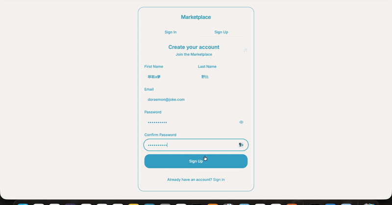
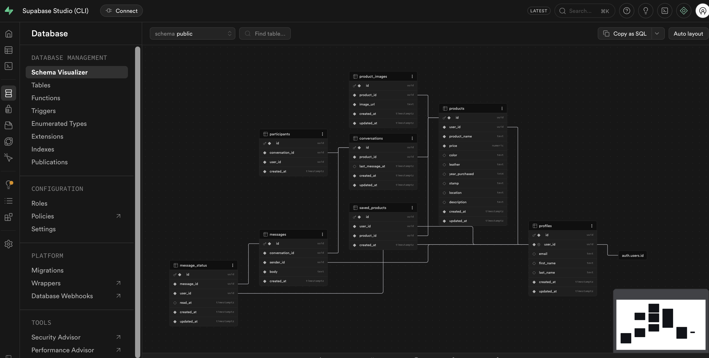
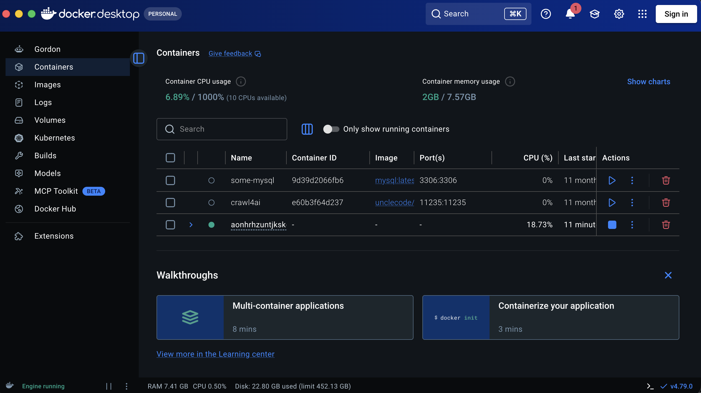

# Toy Marketplace (In Progress)

A peer-to-peer toy marketplace web app where parents can buy and sell second-hand toys. Built as a full-stack project using modern React patterns on the frontend and Supabase as a fully managed backend — covering authentication, relational database, file storage, and real-time features — all without writing a custom server.

## Demo



## Screenshots

All screenshots were captured with Playwright at **iPhone 12 Pro** resolution (390 × 844) against the local dev server.

| File | Description |
|---|---|
| `imgs/homepage-purple.png` | Homepage with the purple brand theme applied |
| `imgs/user-profile.png` | Profile page immediately after a new user signs up |
| `imgs/end-to-end-profile.png` | Profile page for a freshly created seller account (end-to-end flow) |
| `imgs/end-to-end-create-listing.png` | Create-listing form filled with product name, price, image, and location before publishing |
| `imgs/end-to-end-conversation-001.png` | Full buyer–seller conversation: buyer asks about availability and requests a discount; seller replies |
| `imgs/homepage-001.png` | Homepage baseline screenshot |
| `imgs/homepage-verify-toy-bear.png` | Homepage after restoring the Toy Bear product image, confirming both listings appear correctly |

## Tech Stack

### Frontend
| Package | Purpose |
|---|---|
| `react` 18 + `typescript` | UI framework with static typing |
| `vite` | Dev server and bundler (fast HMR) |
| `react-router-dom` v6 | Client-side routing with nested routes |
| `@tanstack/react-query` v5 | Server-state management, caching, and background refetching |
| `react-hook-form` + `zod` | Form state management with schema-based validation |
| `tailwindcss` | Utility-first CSS framework |
| `shadcn/ui` (Radix primitives) | Accessible, unstyled component primitives (Dialog, Sheet, Select, Toast, etc.) |
| `lucide-react` | Icon library |

### Backend (Supabase)
| Service | Purpose |
|---|---|
| **Supabase Auth** | Email/password sign-up and sign-in, JWT session management |
| **Supabase Postgres** | Relational database with Row Level Security (RLS) policies |
| **Supabase Storage** | Image uploads for product listings (`product-images` bucket) |
| **Supabase Realtime** | Presence channel for online user tracking; live message delivery |
| **Supabase RPC** | Server-side Postgres functions to encapsulate business logic and enforce RLS |

### Tooling
- `supabase-js` — official JS client that auto-switches between local and remote Supabase based on hostname
- `supabase CLI` — local development stack (Postgres + Auth + Storage + Studio) running in Docker
- `eslint` — linting
- `playwright` (via MCP) — browser automation used for end-to-end UI testing and screenshot capture
- `context7` (via MCP) — live library documentation injected into AI sessions; see [Context7](#context7--live-library-docs) below

## Features

- **Auth** — email sign-up and sign-in; JWT sessions persisted in `localStorage`; protected routes redirect unauthenticated users to `/auth`
- **Listings** — create, edit, and delete toy listings with up to 5 photos; images are resized to 400×400 via the Canvas API before upload to reduce storage costs
- **Browse** — product listing page with search and sort; backed by the `get_public_products` RPC function
- **Product detail** — single product view with seller info and images; backed by `get_public_product_detail` RPC
- **Messaging** — buyer initiates a conversation per product via `create_conversation` RPC; real-time message delivery; per-message read receipts via `message_status` table
- **Saved items** — save / unsave products to a personal wishlist via `toggle_saved_product` RPC
- **Presence** — Supabase Realtime presence channel (`global-presence`) shows which users are currently online; goes offline after 5 s of hidden tab

## Architecture

```
src/
├── App.tsx                  # Route definitions (React Router v6)
├── pages/                   # Route-level components
│   ├── Categories.tsx        # Home / browse page
│   ├── ProductDetail.tsx
│   ├── CreateListing.tsx     # Seller's listing dashboard
│   ├── CreateListingForm.tsx # Create / edit form
│   ├── ConversationList.tsx
│   ├── ConversationDetail.tsx
│   ├── SavedItems.tsx
│   └── Profile.tsx
├── components/              # Shared UI components
├── hooks/                   # All Supabase data access (TanStack Query)
├── contexts/
│   └── PresenceProvider.tsx # Realtime presence (wraps entire app)
├── integrations/supabase/
│   ├── client.ts            # Supabase client (auto-detects local vs remote)
│   └── types.ts             # Generated DB types + RPC signatures
└── lib/
    └── imageUtils.ts        # Canvas API image resize before upload
```

**Data layer pattern:** all Supabase calls live in `src/hooks/`. Read operations call Supabase RPC functions (keeping RLS logic server-side); mutations call tables directly and invalidate TanStack Query cache.

## Database Schema



### Key Tables

| Table | Description |
|---|---|
| `profiles` | 1:1 with `auth.users`; stores `first_name`, `last_name`, `email` |
| `products` | Toy listings; toy-specific fields: `color`, `leather`, `stamp`, `year_purchased` |
| `product_images` | Multiple images per product (up to 5) |
| `conversations` | One conversation per buyer–product pair |
| `participants` | Maps users to conversations |
| `messages` | Individual chat messages with `sender_id` |
| `message_status` | Per-message read receipts (`read_at` timestamp) |
| `saved_products` | User wishlist (many-to-many between users and products) |

Row Level Security is enabled on all tables. Users can only read/write their own data. Public product browsing is handled via `SECURITY DEFINER` RPC functions so RLS logic stays server-side.

## Context7 — Live Library Docs

This project uses **Context7** as an MCP server tool to pull current, version-accurate documentation directly into Claude Code sessions. Without it, the AI assistant would rely on training-data snapshots that may be months or years out of date.

### Why it matters here

The stack combines several libraries that evolve quickly — Supabase JS v2, TanStack Query v5, React Router v6, shadcn/ui — and subtle API differences between major versions (e.g. TanStack Query v4 → v5 renamed `cacheTime` to `gcTime`, Supabase v1 → v2 changed the auth API) can cause silent bugs if the wrong docs are referenced. Context7 resolves the correct version's docs at query time.

### How it is used here

| Task | Context7 library queried |
|---|---|
| Supabase Realtime channel setup and cleanup | `/llmstxt/supabase_llms-full_txt` |
| TanStack Query v5 hooks (`useQuery`, `useMutation`, cache invalidation) | `/tanstack/query` @ `v5.90.3` |
| React Router v6 nested routes, `useParams`, `useNavigate` | `/websites/reactrouter_6_30_3` |
| React Hook Form + Zod resolver integration | `/react-hook-form/resolvers` + `/websites/zod_dev` |
| shadcn/ui component installation and customisation | `/shadcn-ui/ui` |

During the messaging implementation review, Context7 was used to verify the correct Supabase Realtime `postgres_changes` subscription API — confirming that `.channel().on('postgres_changes', ...).subscribe()` and `supabase.removeChannel(channel)` are the current idiomatic patterns for the JS v2 client.

## Playwright — Browser Automation & Screenshot Capture

This project uses **Playwright** (exposed as an MCP server tool) to drive a real Chromium browser against the local dev server. It is used to:

- **End-to-end flow validation** — sign-up, profile view, product listing creation (including image upload), and buyer–seller messaging are all exercised through real browser interactions, not mocked data.
- **Screenshot capture** — every meaningful UI state is captured at iPhone 12 Pro dimensions (390 × 844) so visual regressions are immediately obvious. Screenshots are committed to `imgs/` for reference.
- **Accessibility-tree navigation** — Playwright's snapshot mode returns the page's accessibility tree instead of raw HTML, making it easy to locate interactive elements by role and label rather than brittle CSS selectors.

### How it is used here

| Scenario | What Playwright does |
|---|---|
| Sign-up | Navigates to `/auth`, switches to the Sign Up tab, fills the form, and submits |
| Profile screenshot | Navigates to `/profile` and calls `browser_take_screenshot` |
| Create listing | Navigates to `/create-listing/new`, fills all fields, triggers the file chooser, uploads an image, and clicks Publish |
| Messaging | Sends a message from the product detail page, opens the conversation, sends a follow-up, then switches accounts and replies |
| Theme verification | Navigates to `/`, resizes to mobile viewport, takes a screenshot to confirm brand colours are applied |

Screenshots are saved directly to the project root then moved to `imgs/` for organised storage.

## Local Development

### Prerequisites

- Node.js 18+
- [Supabase CLI](https://supabase.com/docs/guides/cli)
- Docker Desktop (for the local Supabase stack)

### Setup

```bash
# Install dependencies
npm install

# Start local Supabase stack (Postgres + Auth + Storage + Studio)
supabase start

# Apply migrations and seed test users
supabase db reset

# Start the dev server
npm run dev
```

- App: `http://localhost:8080`
- Supabase Studio: `http://localhost:54323`
- Local email inbox (Inbucket): `http://localhost:54324`

### Test Accounts

Available after `supabase db reset`:

| Email | Password | Role |
|---|---|---|
| user001@gmail.com | Test1234! | Generic test user |
| user002@gmail.com | Test1234! | Generic test user |

The seller account **doraemon@joke.com** (password `11111111A`) is created via the Supabase Auth admin API after `db reset` — see the seed notes in `supabase/seed.sql`. It owns the seeded **Toy Bear** listing.

### Database Migrations

```bash
supabase db reset          # wipe DB and re-apply all migrations + seed (loses data)
supabase migration up      # apply only new pending migrations (keeps existing data)
supabase db push           # deploy migrations to remote Supabase project
```

> **Note:** Only run `supabase db reset` when you need to apply new migrations from scratch. Normal frontend development does not require a reset — data persists between dev server restarts.

## Local Docker Containers

The local Supabase stack runs entirely in Docker. The `aonhrhzuntjkskglqdwv` container is the local Supabase instance.



## Commands

```bash
npm run dev          # start dev server (Vite, localhost:8080)
npm run build        # production build
npm run build:dev    # dev-mode build
npm run lint         # ESLint
npm run preview      # preview production build locally
```
