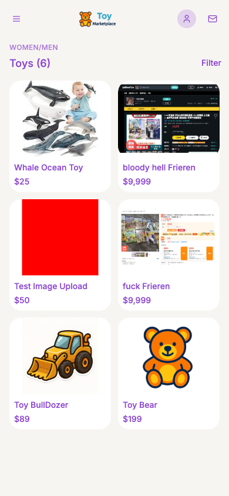
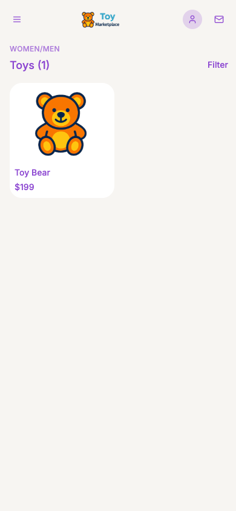
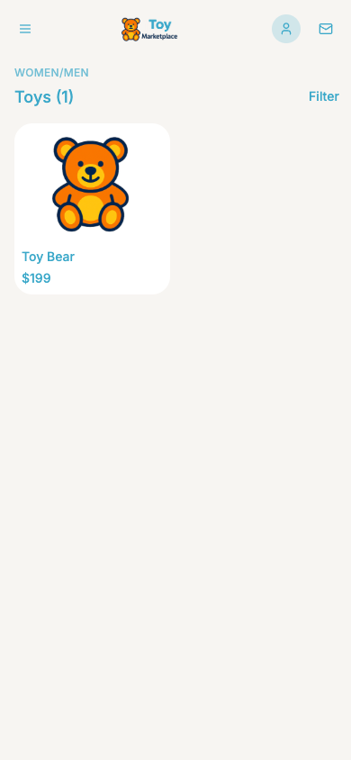
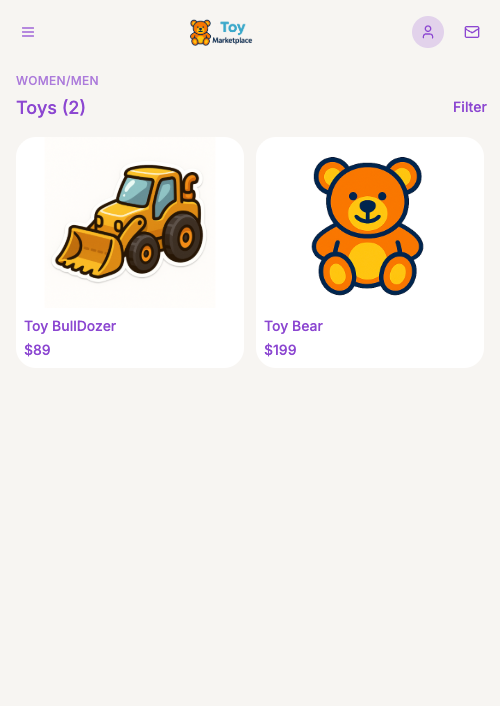
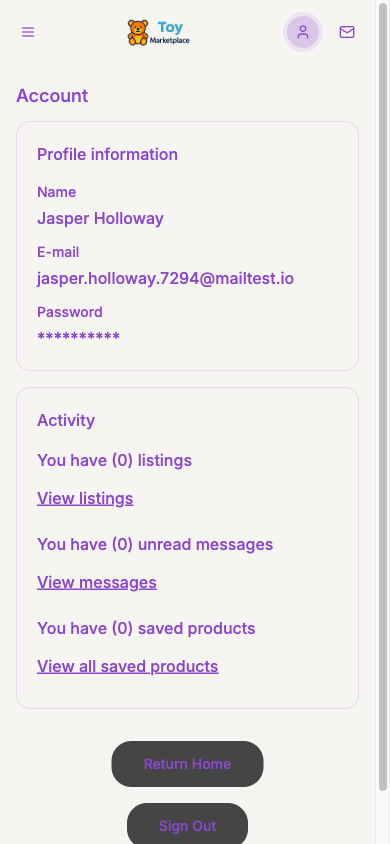
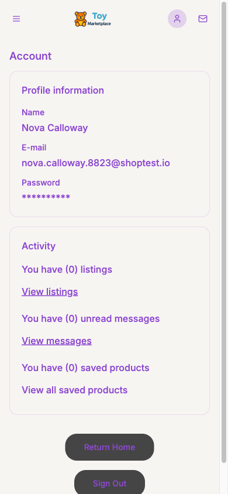
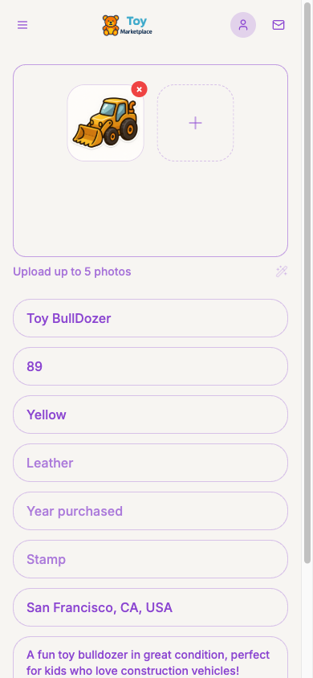
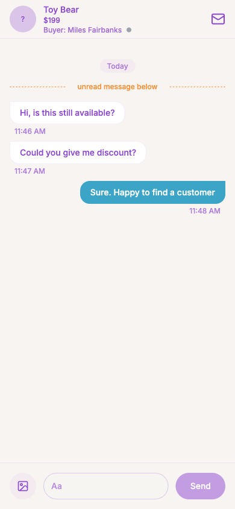

# Toy Marketplace (In Progress)

A peer-to-peer toy marketplace web app where parents can buy and sell second-hand toys. Built as a full-stack project using modern React patterns on the frontend and Supabase as a fully managed backend — covering authentication, relational database, file storage, and real-time features — all without writing a custom server.

## Demo


### Subagent-captured screenshot

The screenshot below was captured automatically by the **`ui-end-to-end-tester`** Claude Code subagent — invoked with a single prompt. The agent restarted the dev server, set the viewport to iPhone 12 Pro (390 × 844), navigated to the homepage, saved the screenshot, and closed the browser — no manual browser interaction required.



## Screenshots

All screenshots were captured with Playwright at **iPhone 12 Pro** resolution (390 × 844) against the local dev server.

### Homepage







### Auth & Profile





### Create Listing



### Messaging



## Tech Stack

### Frontend
| Package | Purpose |
|---|---|
| `react` 18 + `typescript` | UI framework with static typing |
| `vite` | Dev server and bundler (fast HMR) |
| `react-router-dom` v6 | Client-side routing with nested routes |
| `@tanstack/react-query` v5 | Server-state management, caching, and background refetching |
| `react-hook-form` + `zod` | Form state management with schema-based validation |
| `tailwindcss` | Utility-first CSS framework |
| `shadcn/ui` (Radix primitives) | Accessible, unstyled component primitives (Dialog, Sheet, Select, Toast, etc.) |
| `lucide-react` | Icon library |

### Backend (Supabase)
| Service | Purpose |
|---|---|
| **Supabase Auth** | Email/password sign-up and sign-in, JWT session management |
| **Supabase Postgres** | Relational database with Row Level Security (RLS) policies |
| **Supabase Storage** | Image uploads for product listings (`product-images` bucket) |
| **Supabase Realtime** | Presence channel for online user tracking; live message delivery |
| **Supabase RPC** | Server-side Postgres functions to encapsulate business logic and enforce RLS |

### Tooling
- `supabase-js` — official JS client that auto-switches between local and remote Supabase based on hostname
- `supabase CLI` — local development stack (Postgres + Auth + Storage + Studio) running in Docker
- `eslint` — linting
- `playwright` (via MCP) — browser automation used for end-to-end UI testing and screenshot capture
- `context7` (via MCP) — live library documentation injected into AI sessions; see [Context7](#context7--live-library-docs) below
- `@sentry/react` — error monitoring and performance tracing; see [Sentry](#sentry--error-monitoring) below

## Features

- **Auth** — email sign-up and sign-in; JWT sessions persisted in `localStorage`; protected routes redirect unauthenticated users to `/auth`
- **Listings** — create, edit, and delete toy listings with up to 5 photos; images are resized to 400×400 via the Canvas API before upload to reduce storage costs
- **Browse** — product listing page with search and sort; backed by the `get_public_products` RPC function
- **Product detail** — single product view with seller info and images; backed by `get_public_product_detail` RPC
- **Messaging** — buyer initiates a conversation per product via `create_conversation` RPC; real-time message delivery; per-message read receipts via `message_status` table
- **Saved items** — save / unsave products to a personal wishlist via `toggle_saved_product` RPC
- **Presence** — Supabase Realtime presence channel (`global-presence`) shows which users are currently online; goes offline after 5 s of hidden tab

## Architecture

```
src/
├── App.tsx                  # Route definitions (React Router v6)
├── pages/                   # Route-level components
│   ├── Categories.tsx        # Home / browse page
│   ├── ProductDetail.tsx
│   ├── CreateListing.tsx     # Seller's listing dashboard
│   ├── CreateListingForm.tsx # Create / edit form
│   ├── ConversationList.tsx
│   ├── ConversationDetail.tsx
│   ├── SavedItems.tsx
│   └── Profile.tsx
├── components/              # Shared UI components
├── hooks/                   # All Supabase data access (TanStack Query)
├── contexts/
│   └── PresenceProvider.tsx # Realtime presence (wraps entire app)
├── integrations/supabase/
│   ├── client.ts            # Supabase client (auto-detects local vs remote)
│   └── types.ts             # Generated DB types + RPC signatures
└── lib/
    └── imageUtils.ts        # Canvas API image resize before upload
```

**Data layer pattern:** all Supabase calls live in `src/hooks/`. Read operations call Supabase RPC functions (keeping RLS logic server-side); mutations call tables directly and invalidate TanStack Query cache.

## Database Schema


### Key Tables

| Table | Description |
|---|---|
| `profiles` | 1:1 with `auth.users`; stores `first_name`, `last_name`, `email` |
| `products` | Toy listings; toy-specific fields: `color`, `leather`, `stamp`, `year_purchased` |
| `product_images` | Multiple images per product (up to 5) |
| `conversations` | One conversation per buyer–product pair |
| `participants` | Maps users to conversations |
| `messages` | Individual chat messages with `sender_id` |
| `message_status` | Per-message read receipts (`read_at` timestamp) |
| `saved_products` | User wishlist (many-to-many between users and products) |

Row Level Security is enabled on all tables. Users can only read/write their own data. Public product browsing is handled via `SECURITY DEFINER` RPC functions so RLS logic stays server-side.

## Context7 — Live Library Docs

This project uses **Context7** as an MCP server tool to pull current, version-accurate documentation directly into Claude Code sessions. Without it, the AI assistant would rely on training-data snapshots that may be months or years out of date.

### Why it matters here

The stack combines several libraries that evolve quickly — Supabase JS v2, TanStack Query v5, React Router v6, shadcn/ui — and subtle API differences between major versions (e.g. TanStack Query v4 → v5 renamed `cacheTime` to `gcTime`, Supabase v1 → v2 changed the auth API) can cause silent bugs if the wrong docs are referenced. Context7 resolves the correct version's docs at query time.

### How it is used here

| Task | Context7 library queried |
|---|---|
| Supabase Realtime channel setup and cleanup | `/llmstxt/supabase_llms-full_txt` |
| TanStack Query v5 hooks (`useQuery`, `useMutation`, cache invalidation) | `/tanstack/query` @ `v5.90.3` |
| React Router v6 nested routes, `useParams`, `useNavigate` | `/websites/reactrouter_6_30_3` |
| React Hook Form + Zod resolver integration | `/react-hook-form/resolvers` + `/websites/zod_dev` |
| shadcn/ui component installation and customisation | `/shadcn-ui/ui` |

During the messaging implementation review, Context7 was used to verify the correct Supabase Realtime `postgres_changes` subscription API — confirming that `.channel().on('postgres_changes', ...).subscribe()` and `supabase.removeChannel(channel)` are the current idiomatic patterns for the JS v2 client.

### How to invoke Context7 in a Claude Code session

Context7 is available as an MCP tool. You do not need to call it manually — Claude Code triggers it automatically when you ask a question about a library. Under the hood, two tool calls happen:

1. **`resolve-library-id`** — maps a plain name like "Supabase" or "TanStack Query" to a canonical Context7 library ID.
2. **`query-docs`** — fetches a focused documentation excerpt from the resolved library, filtered by a natural-language topic.

**Example prompts that trigger Context7 in this project:**

| What you type | What Context7 fetches |
|---|---|
| "How do I set up a Realtime subscription in Supabase?" | Supabase JS v2 Realtime channel docs |
| "What changed between TanStack Query v4 and v5?" | TanStack Query v5 migration guide |
| "How does `useNavigate` work in React Router v6?" | React Router v6 hooks reference |
| "How do I add a new shadcn/ui component?" | shadcn/ui CLI and component installation docs |

Context7 resolves docs at the **exact version installed in this project** (`package.json` is the source of truth), so you always get API signatures that match the code — not a generic or outdated snapshot.

## Sentry — Error Monitoring

This project uses **Sentry** (`@sentry/react` v10) for real-time error monitoring, performance tracing, and session replay. It is configured via the MCP Sentry server, which lets Claude Code create projects, retrieve DSNs, and query issues directly from the AI session.

### Setup

Sentry is initialised in `src/main.tsx` before the React tree mounts:

```ts
Sentry.init({
  dsn: "...",
  environment: import.meta.env.MODE,        // "development" | "production"
  integrations: [
    Sentry.browserTracingIntegration(),     // page-load and navigation spans
    Sentry.replayIntegration(),             // session replay video on errors
  ],
  tracesSampleRate: 1.0,                   // capture 100% of transactions (reduce in prod)
  replaysSessionSampleRate: 0.1,           // replay 10% of normal sessions
  replaysOnErrorSampleRate: 1.0,           // always replay sessions that hit an error
});
```

### How it is used here

| Feature | How |
|---|---|
| **Automatic error capture** | Any uncaught exception in the React tree is sent to Sentry automatically via the SDK's global error handler |
| **Error boundary** | `About.tsx` is wrapped with `Sentry.withErrorBoundary`, which catches render errors, sends them to Sentry, and shows a fallback UI with a user feedback dialog |
| **Manual event capture** | `Sentry.captureMessage()` sends discrete info/warning events (used on the About page test button) |
| **Performance tracing** | `browserTracingIntegration` automatically instruments route transitions and XHR/fetch calls |
| **Session replay** | `replayIntegration` records a video-like replay of the user's session, attached to any error event |

### MCP Sentry integration

The Sentry MCP server (`mcp__sentry__*` tools) is used in Claude Code sessions to:

- **Create projects** — `create_project` provisions a new Sentry project and returns the DSN in one step
- **Query issues** — `search_issues` and `get_sentry_resource` let Claude look up live error events without leaving the editor
- **Analyse issues** — `analyze_issue_with_seer` runs Sentry's AI root-cause analysis on a specific issue

### Testing the integration

Navigate to `/about` in the running app. Two buttons are available:

| Button | What it does |
|---|---|
| **Send test message** | Calls `Sentry.captureMessage(...)` — appears as an Info event in the Sentry dashboard |
| **Throw test error** | Throws a JavaScript exception inside the component — caught by the error boundary, sent to Sentry as an exception, and triggers the Sentry user-feedback dialog |

Events appear in the Sentry dashboard at `https://frealancer-i0.sentry.io` within a few seconds.

### Sentry project details

| Field | Value |
|---|---|
| Organisation | `frealancer-i0` |
| Project | `toy-marketplace` |
| Platform | `javascript-react` |
| Dashboard | https://frealancer-i0.sentry.io/projects/toy-marketplace/ |

## Playwright — Browser Automation & Screenshot Capture

This project uses **Playwright** (exposed as an MCP server tool) to drive a real Chromium browser against the local dev server. It is used to:

- **End-to-end flow validation** — sign-up, profile view, product listing creation (including image upload), and buyer–seller messaging are all exercised through real browser interactions, not mocked data.
- **Screenshot capture** — every meaningful UI state is captured at iPhone 12 Pro dimensions (390 × 844) so visual regressions are immediately obvious. Screenshots are committed to `imgs/` for reference.
- **Accessibility-tree navigation** — Playwright's snapshot mode returns the page's accessibility tree instead of raw HTML, making it easy to locate interactive elements by role and label rather than brittle CSS selectors.

### How it is used here

| Scenario | What Playwright does |
|---|---|
| Sign-up | Navigates to `/auth`, switches to the Sign Up tab, fills the form, and submits |
| Profile screenshot | Navigates to `/profile` and calls `browser_take_screenshot` |
| Create listing | Navigates to `/create-listing/new`, fills all fields, triggers the file chooser, uploads an image, and clicks Publish |
| Messaging | Sends a message from the product detail page, opens the conversation, sends a follow-up, then switches accounts and replies |
| Theme verification | Navigates to `/`, resizes to mobile viewport, takes a screenshot to confirm brand colours are applied |

Screenshots are saved directly to the project root then moved to `imgs/` for organised storage.

## Claude Code Subagents

This project uses **Claude Code subagents** — specialised AI agents launched from within the main Claude Code session — to offload focused, multi-step tasks without polluting the main conversation context.

### `ui-end-to-end-tester`

A dedicated subagent for browser automation and screenshot capture. It is invoked via the `Agent` tool with `subagent_type: "ui-end-to-end-tester"` and runs asynchronously in the background while the main session stays available.

**What it does in a single prompt:**

1. Kills any existing process on the configured port
2. Starts the Vite dev server (`npm run dev`)
3. Opens a Chromium browser and sets the viewport (e.g. iPhone 12 Pro: 390 × 844)
4. Navigates to the target URL and waits for network idle
5. Takes a screenshot and saves it to the project directory
6. Closes the browser and reports what it observed (page title, visible content, console errors)

**Example invocation (from the main Claude Code session):**

```
Use a subagent to restart the dev server, open the homepage at iPhone 12 Pro dimensions,
take a screenshot named homepage-001.png, and close the browser.
```

**Why subagents here?**
- Browser automation produces verbose tool output (snapshots, console logs, network events). Routing it through a subagent keeps that noise out of the main context window.
- The main session stays responsive while the agent works — useful for longer test flows like sign-up, listing creation, or multi-account messaging.
- The agent returns a structured summary (files saved, what was visible, any errors) rather than raw tool traces.

**Note:** The Vite dev server in this project runs on **port 8080** (set in `vite.config.ts`), not the Vite default of 5173.

## Local Development

### Prerequisites

- Node.js 18+
- [Supabase CLI](https://supabase.com/docs/guides/cli)
- Docker Desktop (for the local Supabase stack)

### Setup

```bash
# Install dependencies
npm install

# Start local Supabase stack (Postgres + Auth + Storage + Studio)
supabase start

# Apply migrations and seed test users
supabase db reset

# Start the dev server
npm run dev
```

- App: `http://localhost:8080`
- Supabase Studio: `http://localhost:54323`
- Local email inbox (Inbucket): `http://localhost:54324`

### Test Accounts

Available after `supabase db reset`:

| Email | Password | Role |
|---|---|---|
| user001@gmail.com | Test1234! | Generic test user |
| user002@gmail.com | Test1234! | Generic test user |

The seller account **doraemon@joke.com** (password `11111111A`) is created via the Supabase Auth admin API after `db reset` — see the seed notes in `supabase/seed.sql`. It owns the seeded **Toy Bear** listing.

### Database Migrations

```bash
supabase db reset          # wipe DB and re-apply all migrations + seed (loses data)
supabase migration up      # apply only new pending migrations (keeps existing data)
supabase db push           # deploy migrations to remote Supabase project
```

> **Note:** Only run `supabase db reset` when you need to apply new migrations from scratch. Normal frontend development does not require a reset — data persists between dev server restarts.

## Local Docker Containers

The local Supabase stack runs entirely in Docker. The `aonhrhzuntjkskglqdwv` container is the local Supabase instance.


## Commands

```bash
npm run dev          # start dev server (Vite, localhost:8080)
npm run build        # production build
npm run build:dev    # dev-mode build
npm run lint         # ESLint
npm run preview      # preview production build locally
```

## Claude Code Hooks

Claude Code supports **hooks** — shell commands wired to specific events in the AI session lifecycle. Hooks run automatically without any prompt from the developer; they fire whenever the matching event occurs, receive structured JSON describing that event over stdin, and can return a JSON response that either allows or blocks the action. This makes hooks ideal for enforcing project standards that should never be skipped regardless of how the AI is asked to work.

All hooks for this project are configured in `.claude/settings.json` and implemented as TypeScript scripts under `.claude/hooks/`. There are four hooks active in this project.

### `UserPromptSubmit` — skills reminder

**Event:** fires every time the user sends a message, before the model processes it.

**What it does:** echoes a short reminder — `"MUST check whether there are relevant skills to use first."` — into the system context for that turn. This message appears as a `<system-reminder>` tag visible to the model but not to the user.

**Why it exists:** without this nudge, the model can start planning or exploring files before remembering to invoke the `supabase` skill. The reminder fires unconditionally so the check is never skipped, even for short or ambiguous prompts.

### `Notification` — sound alert

**Event:** fires whenever Claude Code emits a notification — most commonly when it is waiting for the user to approve or deny a permission prompt (e.g. running a Bash command in default mode).

**What it does:** calls `afplay` (macOS built-in audio player) to play a short MP3 stored at `.claude/hooks/default-notification-hook-reminder.mp3`. It logs activity to `notification_hook_debug.log`.

**Why it exists:** permission prompts are easy to miss when working in another window. The sound draws attention back to the terminal so approvals are not left pending.

### `PreToolUse` (Bash) — lint gate before commits

**Event:** fires before every `Bash` tool call, matched on the `Bash` tool name.

**What it does:** inspects the command Claude is about to run. If it contains `git commit`, the hook:
1. Identifies all staged files (`git diff --cached --name-only`).
2. Runs **ESLint** (`npx eslint`) on any staged `.ts` / `.tsx` / `.js` / `.jsx` files.
3. Runs **flake8** on any staged `.py` files, and optionally **black --check** if a `requirements.txt` or `pyproject.toml` is present.
4. Returns `decision: "block"` if any linter reports errors, preventing the commit from landing. Returns `decision: "approve"` if everything passes.

For all other Bash commands the hook immediately approves without running any checks.

**Why it exists:** it ensures the AI can never commit code that fails the project linter, regardless of whether it was told to skip checks. The gate is in the harness, not in the prompt, so it cannot be talked around.

### `PostToolUse` (Edit / Write) — automatic test runner

**Event:** fires after any `Edit`, `MultiEdit`, or `Write` tool call completes successfully.

**What it does:** checks whether the file that was just written is a source file (inside `src/`, with a `.ts` / `.tsx` / `.js` / `.jsx` extension, and not a `.test.` or `.spec.` file). If it is, the hook auto-discovers the test suite by inspecting `package.json` scripts and `devDependencies` — looking for `test:unit`, `vitest`, or `jest` in that order — and runs the tests. It injects the result back into the session as a `systemMessage` so the model sees whether tests passed or failed without needing to be asked.

If no test suite is found (as is currently the case in this project, which has no unit tests configured), the hook reports that instead of silently doing nothing.

**Why it exists:** it closes the feedback loop between code changes and correctness automatically. The model does not need to remember to run tests after editing; the harness does it.

---

All four hooks are non-blocking in the error path: if a hook itself throws an exception or cannot parse its input, it falls back to `permissionDecision: "allow"` so that hook bugs never freeze the development workflow. Debug output is written to dedicated log files in `.claude/hooks/` for troubleshooting.

## Claude Code Skills

Claude Code supports **project-defined skills** — instruction files stored under `.claude/skills/<name>/SKILL.md` that are loaded into the AI session whenever a matching task comes up. Unlike general memory or CLAUDE.md guidelines, a skill is a structured, domain-specific runbook: it tells the model exactly what to do, what order to do it in, and what pitfalls to avoid for a particular class of work. Skills are invoked explicitly (via the `Skill` tool) and their content is injected into the conversation at the moment they are needed, so the guidance is always in context when it matters.

This project currently defines one skill.

### `supabase` skill

**Location:** `.claude/skills/supabase/SKILL.md`

The `supabase` skill is declared as **required for all database work** and must be invoked before any task that touches the Supabase backend — migrations, RPC functions, schema changes, RLS policies, or deployment. Its purpose is to enforce a consistent, safe workflow so that the AI assistant never takes a shortcut that could corrupt schema history or introduce a permissions bug.

The core rules it encodes are:

**Migration discipline.** Every schema change must go through a versioned migration file under `supabase/migrations/`, created with `supabase migration new <name>` before any SQL is written. Direct SQL console edits are explicitly forbidden. This keeps the full schema history in git and makes `supabase db reset` a reliable way to rebuild the database from scratch.

**RPC-first data access.** The skill instructs the model to always check existing RPC functions in the consolidated migration before writing new queries. Direct table queries frequently hit RLS permission walls; `SECURITY DEFINER` RPC functions are the idiomatic escape hatch. The skill lists the required boilerplate: `DROP FUNCTION IF EXISTS` before `CREATE FUNCTION` (to handle return-type changes), explicit `LANGUAGE`, `SECURITY` level, and `SET search_path`, and a `GRANT EXECUTE` statement for the relevant roles.

**Type regeneration.** After any schema change, the skill mandates running `npx supabase gen types typescript --local > src/integrations/supabase/types.ts` to keep the TypeScript layer in sync with the database. Skipping this step is a common source of silent type mismatches between the frontend and the actual table/function signatures.

**Local-before-remote workflow.** All migrations are tested against the local Docker stack (`supabase db reset`) before being pushed to the remote project with `supabase db push`. The skill includes the full link/push command sequence and a verification checklist using `psql` and `\d` to confirm the schema landed correctly.

**Why a skill rather than CLAUDE.md?** CLAUDE.md is loaded every session and kept deliberately short — it documents the overall architecture and points to conventions. The `supabase` skill is longer, more procedural, and only relevant when database work is in scope. Loading it on demand keeps the main context lean and ensures the detailed guidance appears precisely when needed rather than as background noise in every session.
